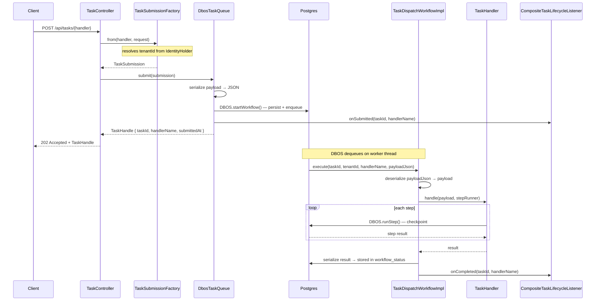
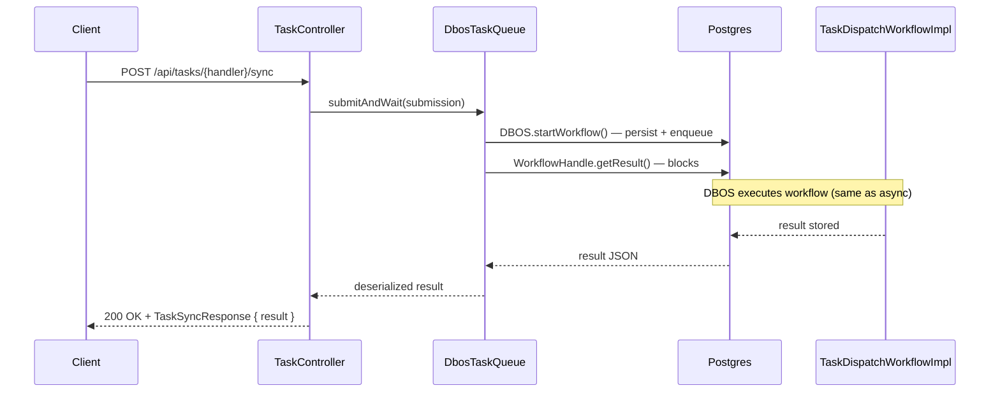
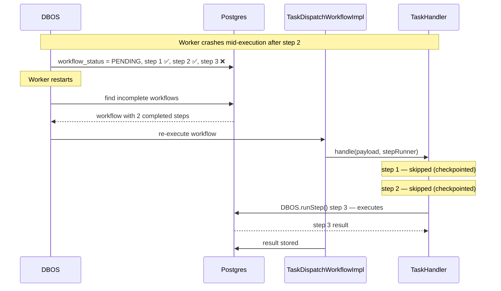

# Architecture — core-scheduling

This document describes the design decisions, module structure, and internal architecture of `core-scheduling`.

---

## Goals

- Provide a **unified task execution API** that any OpenLeap service can use without writing boilerplate
- Abstract away the execution backend — services code against the `api` package only, never against DBOS or executor internals
- Make task execution **durable by default** — if a service crashes mid-execution, tasks resume automatically
- Support **local development** without requiring DBOS or Postgres via an in-memory fallback

---

## Module Structure

```
api/
  exception/          ← public exception hierarchy
  handler/            ← TaskHandler, StepRunner, RetryOptions
  listener/           ← TaskLifecycleListener interface
  queue/              ← TaskQueue, TaskHandle, TaskSubmission, TaskResult, TaskStatus

config/               ← Spring Boot auto-configuration entry point
  TaskAutoConfiguration
  TaskWebAutoConfiguration
  TaskRetryProperties

registry/             ← TaskHandlerRegistry — maps handler names to implementations

listener/             ← built-in lifecycle listener implementations
  CompositeTaskLifecycleListener
  TaskLoggingListener
  TaskMetricsListener

iam/                  ← tenant isolation
  AuthorizeTenantAccess (annotation)
  TenantAccessAspect
  TaskAuthorizationService

messaging/            ← optional domain event publishing
  TaskEventPublisher
  TaskMessagingConfiguration

web/                  ← auto-registered REST controller
  TaskController
  TaskExceptionHandler
  dto/
  support/

dbos/                 ← DBOS execution backend (internal, never exposed)
  config/
  queue/
  step/
  workflow/

inmemory/             ← in-memory execution backend (internal, never exposed)
  config/
  queue/
  step/
```

Consuming services only ever import from `api.*`. Everything under `dbos.*` and `inmemory.*` is an internal implementation detail.

---

## Execution Flow

### Async (`POST /api/tasks/{handler}`)



### Sync (`POST /api/tasks/{handler}/sync`)



### Crash Recovery



---

## Why DBOS

The original `t1_rpt` service had a hand-rolled durable execution system:

| Hand-rolled | DBOS equivalent |
|---|---|
| `QueuePoller` + `FOR UPDATE SKIP LOCKED` | DBOS internal polling |
| `QueueProcessor` + thread pool management | DBOS workflow executor |
| `QueueReverter` + stale job scanning | DBOS crash recovery |
| `JobEntity` status updates | DBOS `workflow_status` table |

DBOS replaces all of this. The only reason `TaskEntity` (or equivalent) still exists in consuming services is for **domain queryability** — DBOS tables are not queryable by domain fields like `templateId` or `tenantId`.

---

## Per-Handler Workflow Registration

Each `TaskHandler` gets its own DBOS workflow registration:

```java
DBOS.registerWorkflows(TaskDispatchWorkflow.class, impl, handler.name());
```

`handler.name()` becomes the DBOS instance name (e.g. `"render"`, `"email"`). This means:
- Each handler appears as a **distinct workflow** in the DBOS Conductor UI
- A crash in `render` workflows doesn't interfere with `email` workflow recovery
- Concurrency limits can be set per handler in future (per-queue support planned)

---

## Tenant Isolation

Task IDs are structured as `{tenantId}/{uuid}`:

```java
String taskId = submission.getTenantId() + "/" + UUID.randomUUID();
```

`@AuthorizeTenantAccess` on `getStatus` and `cancel` uses `TaskAuthorizationService` to verify the taskId prefix matches the current tenant from `IdentityHolder`. This is an AOP aspect — no changes needed in the controller itself.

Queue submissions use `withQueuePartitionKey(tenantId)` — DBOS partitions the queue by tenant, preventing a single heavy tenant from starving others.

---

## Lifecycle Listeners

`CompositeTaskLifecycleListener` fans out all lifecycle events to every registered `TaskLifecycleListener` bean. Services can add their own listeners by implementing the interface and declaring a `@Component` — no registration needed.

```
onSubmitted  →  TaskLoggingListener, TaskMetricsListener, TaskEventPublisher, ...
onCompleted  →  TaskLoggingListener, TaskMetricsListener, TaskEventPublisher, ...
onFailed     →  TaskLoggingListener, TaskMetricsListener, TaskEventPublisher, ...
onCancelled  →  TaskLoggingListener, TaskMetricsListener, TaskEventPublisher, ...
```

`onCompleted` and `onFailed` carry `handlerName` for tagging. `onCancelled` does not — retrieving the handler name at cancel time requires a DBOS status lookup and the value is low-signal for metrics.

---

## In-Memory vs DBOS

| | In-memory | DBOS |
|---|---|---|
| Crash recovery | ❌ | ✅ |
| Persistence | ❌ | ✅ |
| Requires Postgres | ❌ | ✅ |
| Deduplication | In-JVM only | Persistent |
| Suitable for | Tests, local dev | Production |

Switch via `task.executor: in-memory` in `application.yml`.

---

## Key Design Decisions

**Why not expose DBOS types in the API?**
DBOS is an implementation detail. Leaking `WorkflowHandle`, `Queue`, or `WorkflowStatus` into the `api` package would couple consuming services to DBOS, making it impossible to swap the backend without changing consumers.

**Why `TaskHandler` instead of `@Workflow` directly?**
Services implementing `@Workflow` directly would need to import DBOS annotations. `TaskHandler` keeps the handler code free of framework dependencies — it's just a plain Java interface.

**Why `StepRunner` instead of `DBOS.runStep` directly?**
Same reason — `StepRunner` abstracts the checkpointing mechanism. The in-memory `DirectStepRunner` simply executes steps synchronously, while `DbosStepRunner` checkpoints them via DBOS. Handler code is identical regardless of backend.

**Why one `TaskDispatchWorkflow` per handler?**
A single generic workflow would register all handlers under the same workflow name, making them indistinguishable in the Conductor UI and preventing independent recovery. Registering one proxy per handler (using `handler.name()` as the instance name) gives each handler its own DBOS identity.
