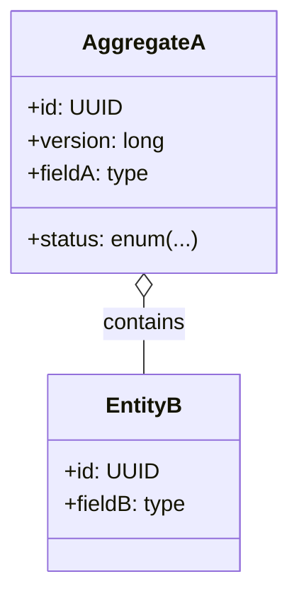

# Microservice Developer Guideline (Spring Boot 4 + RabbitMQ)

Purpose
- This guideline turns the attached template-spec into prescriptive implementation rules for building event-driven (not event-sourced) microservices in the OpenLeap style.
- It encodes the agreed decisions: RabbitMQ, Spring Boot 4, transactional outbox with a polling dispatcher, messaging preferred for commands (REST supported via internal command bus), informational broadcast events with minimal payload (optional version), synchronous REST reads with ETag/If-Match and page/size defaults, and multi-tenancy.

Conventions
- Suite = <suite> (e.g., pps, fi, sd, hr, ps, t1, t2)
- Domain = <domain> (e.g., pd, pur, im, wm, gl, ap, sd, hr, ps)
- Package base = io.openleap.<suite>.<domain>
- API base path = /api/<suite>/<domain>/v1
- Events exchange = <suite>.<domain>.events (topic)
- Commands exchange = <suite>.<domain>.commands (topic)
- Routing keys = <suite>.<domain>.<aggregate>.<event|command>
- Consumer queue = <consumerSuite>.<consumerDomain>.in.<suite>.<domain>.<topic>

---

## 1. High-Level Overview

Architecture principles
- Event-driven, not event-sourced: State is persisted in a relational store (PostgreSQL). All mutations are driven by commands and produce outbox records which are dispatched to RabbitMQ.
- Two event categories
  - Command-handling (internal mechanism): Aggregate changes are written transactionally with outbox records.
  - Informational events (broadcast): Minimal payload to announce a state change to external consumers.
- Reads are synchronous via REST only: Strong consistency inside the service boundary; avoid read models built by consuming other services’ events.
- Four-tier layering: API → Application (use cases/command handlers) → Domain (aggregates, invariants) → Infra (DB, messaging, external clients). Dependencies flow inwards only.

---

## 2. Domain Model (UML-style)

Guidance
- Model aggregate roots that guard invariants. Entities/value objects live inside aggregates.
- Keep invariants inside the domain layer; do not leak persistence/modeling concerns upward.
- Prefer UUID identifiers.
- Version the aggregate using an integer `version` (JPA `@Version`) to support optimistic concurrency and ETag mapping.

Mermaid example skeleton


---

## 3. Aggregates & Invariants

Checklist per aggregate
- Invariants: List strict rules enforced atomically (unique keys, state transitions).
- Lifecycle: Enumerate valid states and transitions; reject invalid transitions.
- Concurrency: Use optimistic locking; reject updates on stale `version`.
- Idempotency: Mutating command handlers must be idempotent using `commandId` and/or natural keys.

Format example
- Order
  - Invariant: totalAmount ≥ 0; cannot move from CANCELLED to any other state
  - Lifecycle: DRAFT → CONFIRMED → FULFILLED → CANCELLED; forbidden transitions: FULFILLED→DRAFT

---

## 4. Events

Exchanges & routing
- Events exchange: `<suite>.<domain>.events` (topic)
- Commands exchange: `<suite>.<domain>.commands` (topic)
- Routing keys: `<suite>.<domain>.<aggregate>.<event|command>`
- Consumer queues: `<consumerSuite>.<consumerDomain>.in.<suite>.<domain>.<topic>` (durable, manually acked)

Envelope fields (for published informational events)
- `eventId` (UUID)
- `traceId` (string)
- `tenantId` (string)
- `occurredAt` (timestamptz)
- `producer` (service id, e.g., `<suite>.<domain>`)
- `schemaRef` (string/URI to JSON schema)
- `payload` (object)

Informational event minimal payload
```json
{
  "aggregateType": "<suite>.<domain>.<aggregate>",
  "changeType": "created|updated|deleted|statusChanged",
  "entityIds": ["<uuid>", "<uuid>"]
  ,"version": 123
}
```
Notes
- `version` is optional and refers to the aggregate revision to help cache invalidation.
- Do not include business payload; consumers must call the authoritative REST API to read details.

Inbound events
- Use informational events from other services only for cache invalidation or background enrichment, never as the sole source of truth.

Contracts
- Maintain JSON Schemas in `contracts/events/<suite>/<domain>/*.schema.json` and reference them in `schemaRef`.

---

## 5. Commands & Command Handling

Ingress channels
- Messaging (preferred): Producers publish to `<suite>.<domain>.commands` using routing key `<suite>.<domain>.<aggregate>.<command>`.
- REST: `/api/<suite>/<domain>/v1/commands/...` maps to internal command bus and enqueues/executes the command synchronously within the service boundary (no distributed transaction).

Command envelope (recommended fields)
```json
{
  "commandId": "<uuid>",
  "traceId": "<uuid>",
  "tenantId": "<tenant>",
  "initiator": "user-or-system",
  "expectedVersion": 12,
  "payload": {}
}
```

Idempotency
- Persist a `command_dedup` entry keyed by `(command_id)` or a domain-specific unique key.
- Command handlers must be safe to reprocess. Use unique constraints and `ON CONFLICT DO NOTHING` patterns.

Transactional boundary
- Within a single DB transaction: validate domain rules → mutate aggregates → insert outbox records.
- After commit: the polling dispatcher picks up outbox records and publishes to RabbitMQ with publisher confirms; then marks records processed.

---

## 6. REST API — Reads (and thin writes if required)

Base path
- `/api/<suite>/<domain>/v1`

Reads
- Use `ETag/If-Match` on mutable resources.
- Support pagination: `page`, `size` (default 50), `sort`.

Error model (standard envelope)
```json
{
  "status": 404,
  "code": "<domain-specific-code>",
  "message": "Resource not found",
  "details": [ {"path": "id", "message": "unknown id"} ],
  "traceId": "<traceId>",
  "timestamp": "2025-01-01T12:00:00Z"
}
```

Recommended status codes
- 400, 401, 403, 404, 409, 412, 422 as per template.

Versioning
- Backward compatible (additive) within `v1`; breaking changes require a new base path version.

---

## 7. Integrations

- List consumers of this domain’s informational events.
- List inbound dependencies (events and synchronous REST lookups).
- Queue naming: `<consumerSuite>.<consumerDomain>.in.<suite>.<domain>.<topic>`
- Tier‑1 services (ref/i18n/si/dms/rpt) called synchronously with retries and circuit breakers.

---

## 8. Data Storage Design

Database
- PostgreSQL is the standard.
- Schemas (shared DB): use schema `<suite>_<domain>`; table names MUST NOT repeat the domain. Example: `<suite>_<domain>.invoice`, `<suite>_<domain>.outbox_events`.
- Private DB: using the default schema is acceptable; still do not prefix table names with the domain (use `invoice`, `outbox_events`).
- Time: always `timestamptz` UTC.
- Strong FK integrity within the service; cross-service relationships store foreign identifiers only.

Multi-tenancy
- Add `tenant_id` to all domain tables and indexes as appropriate.
- Optional: Row Level Security (RLS). If enabled, define `USING (tenant_id = current_setting('app.tenant_id')::text)`
  and set `app.tenant_id` per request.

Outbox table (standardized)
```sql
-- Shared DB: qualify with schema <suite>_<domain>
CREATE SCHEMA IF NOT EXISTS <suite>_<domain>;
CREATE TABLE IF NOT EXISTS <suite>_<domain>.outbox_events (
  id              uuid PRIMARY KEY,
  aggregate_type  text        NOT NULL,
  aggregate_id    uuid        NOT NULL,
  type            text        NOT NULL,
  payload         jsonb       NOT NULL,
  occurred_at     timestamptz NOT NULL DEFAULT now(),
  processed_at    timestamptz NULL,
  tenant_id       text        NOT NULL,
  trace_id        text        NOT NULL
);
CREATE INDEX IF NOT EXISTS outbox_events_unprocessed_idx
  ON <suite>_<domain>.outbox_events (occurred_at)
  WHERE processed_at IS NULL;

-- Private DB: omit schema qualification and also do not prefix table names with domain
-- CREATE TABLE IF NOT EXISTS outbox_events (...);
```

Other invariants & constraints
- Declare NOT NULL, PK/UNIQUE, FK, CHECK constraints explicitly.
- Add covering indexes for frequent filters: `(tenant_id, status, updated_at desc)`.

Column ordering (standard)
- To keep schemas consistent and easy to scan, define the column order for all domain tables as follows:
  1. Primary key (e.g., `id`)
  2. `tenant_id`
  3. UUID identifiers (entity/foreign identifiers, e.g., `customer_id`, `order_id`)
  4. Semantic/business columns (the actual attributes of the business object)
  5. Technical/audit columns (e.g., `version`, `created_at`, `created_by`, `updated_at`, `updated_by`, optional `deleted_at`)
- Rationale: places identity and multi‑tenancy first for indexing and filtering, keeps business data grouped, and ends with audit/metadata for uniform diffs and readability.

Migrations
- Use Flyway. Naming: `V<YYYYMMDDHHmmss>__<short_name>.sql`.

---

## 9. Messaging (RabbitMQ) & Dispatcher

RabbitMQ resources
- Topic exchanges:
  - `<suite>.<domain>.commands`
  - `<suite>.<domain>.events`
- Queues (durable): `<consumerSuite>.<consumerDomain>.in.<suite>.<domain>.<topic>` with manual acks.
- Bindings: routing key `<suite>.<domain>.<aggregate>.*`

Publisher confirms & mandatory
- Enable publisher confirms (correlated) and `mandatory` flag; handle returns for unroutable messages.

Consumer prefetch & backpressure
- Start with `prefetch=20` and adjust per handler latency.

Retries & DLQ
- Pattern: main queue → retry queue(s) with TTL → back to main → after N attempts (e.g., 5 total) → DLQ.
- Alert on DLQ depth > 0.

Ordering
- Use per-aggregate routing key patterns and ensure single logical consumer for a key if strict ordering is required.

Polling dispatcher (outbox publisher)
- Runs on a fixed schedule (e.g., 250ms) and can be woken manually via an actuator endpoint.
- Algorithm: fetch N oldest unprocessed → publish with messageId=id → on confirm mark processed → on failure retry with backoff.

Manual wake-up
- Provide `POST /actuator/outbox/publish` (secured) to trigger immediate publishing.

---

## 10. Security & Roles

- Auth: OAuth2/JWT (provider-agnostic; Keycloak commonly used). Validate JWT on REST.
- Roles: VIEWER/EDITOR/APPROVER/ADMIN. Map to endpoint methods.
- PII: encrypt at rest where needed; avoid emitting PII in events or logs.
- Audit: write audit logs for security-sensitive changes; informational events help with audit trails but are not sufficient alone.

---

## 11. Non-Functional Requirements

- Latency: Reads P95 ≤ 150ms under nominal load (tune per domain).
- Throughput: Define target RPS and sustained event publishing rate.
- Availability: Target 99.9%.
- Consistency: Strong within service via DB transactions; eventual across services via events.
- Startup/shutdown: Graceful consumer start after DB connectivity; drain and stop on SIGTERM.

---

## 12. Observability (Spring Boot 4 compliant)

Metrics & Tracing stack
- Metrics: Micrometer 2 (Prometheus registry suggested).
- Tracing: Micrometer Tracing 2 + OTel bridge (`micrometer-tracing-bridge-otel`) + OTLP exporter to OTel Collector.
- Logs: JSON with `traceId`, `spanId`, `tenantId`, `commandId`/`eventId`.

Key metrics to expose
- REST: request count, latency (RED), error ratio.
- Outbox: lag (oldest unprocessed age), batch size, publish failures.
- RabbitMQ: consumer lag (queue depth), DLQ depth, handler error rate.
- DB: connection pool metrics, slow queries.

Tracing propagation
- Propagate `traceId` through REST and RabbitMQ headers; include `tenantId` as baggage where permitted.

---

## 13. Testing & Contracts

Contract-first
- REST: OpenAPI in `contracts/http/<suite>/<domain>/*`.
- Events: JSON Schemas in `contracts/events/<suite>/<domain>/*`.

Tests
- Unit tests for domain invariants.
- Integration tests with Testcontainers (PostgreSQL, RabbitMQ).
- Dispatcher integration: verify at-least-once semantics and idempotent consumers.
- CDC/contract tests for REST and event schemas.
- Deterministic time/UUID providers in tests.

---

## 14. Implementation Recipes (Spring Boot 4)

Dependencies (Maven pom.xml snippet)
```xml
<dependencies>
  <dependency>
    <groupId>org.springframework.boot</groupId>
    <artifactId>spring-boot-starter-web</artifactId>
  </dependency>
  <dependency>
    <groupId>org.springframework.boot</groupId>
    <artifactId>spring-boot-starter-amqp</artifactId>
  </dependency>
  <dependency>
    <groupId>org.springframework.boot</groupId>
    <artifactId>spring-boot-starter-data-jpa</artifactId>
  </dependency>
  <dependency>
    <groupId>org.springframework.boot</groupId>
    <artifactId>spring-boot-starter-validation</artifactId>
  </dependency>
  <dependency>
    <groupId>org.springframework.boot</groupId>
    <artifactId>spring-boot-starter-actuator</artifactId>
  </dependency>

  <dependency>
    <groupId>org.postgresql</groupId>
    <artifactId>postgresql</artifactId>
    <scope>runtime</scope>
  </dependency>
  <dependency>
    <groupId>org.flywaydb</groupId>
    <artifactId>flyway-core</artifactId>
  </dependency>

  <!-- Observability -->
  <dependency>
    <groupId>io.micrometer</groupId>
    <artifactId>micrometer-core</artifactId>
  </dependency>
  <dependency>
    <groupId>io.micrometer</groupId>
    <artifactId>micrometer-registry-prometheus</artifactId>
    <scope>runtime</scope>
  </dependency>
  <dependency>
    <groupId>io.micrometer</groupId>
    <artifactId>micrometer-tracing</artifactId>
  </dependency>
  <dependency>
    <groupId>io.micrometer</groupId>
    <artifactId>micrometer-tracing-bridge-otel</artifactId>
  </dependency>
  <dependency>
    <groupId>io.opentelemetry</groupId>
    <artifactId>opentelemetry-exporter-otlp</artifactId>
    <scope>runtime</scope>
  </dependency>

  <!-- Test -->
  <dependency>
    <groupId>org.springframework.boot</groupId>
    <artifactId>spring-boot-starter-test</artifactId>
    <scope>test</scope>
  </dependency>
  <dependency>
    <groupId>org.testcontainers</groupId>
    <artifactId>postgresql</artifactId>
    <scope>test</scope>
  </dependency>
  <dependency>
    <groupId>org.testcontainers</groupId>
    <artifactId>rabbitmq</artifactId>
    <scope>test</scope>
  </dependency>
</dependencies>
```

application.yml (snippets)
```yaml
spring:
  rabbitmq:
    publisher-confirm-type: correlated
    template:
      mandatory: true
    observations:
      enabled: true

management:
  endpoints:
    web:
      exposure:
        include: health,info,metrics,prometheus

spring.data.web.pageable.default-page-size: 50
```

Outbox JPA entity (Java)
```java
@Entity
@Table(name = "outbox_events", schema = "<suite>_<domain>")
public class OutboxEvent {
  @Id UUID id;
  @Column(nullable=false) String aggregateType;
  @Column(nullable=false) UUID aggregateId;
  @Column(nullable=false) String type;
  @Column(nullable=false, columnDefinition = "jsonb") String payload;
  @Column(nullable=false) Instant occurredAt = Instant.now();
  Instant processedAt;
  @Column(nullable=false) String tenantId;
  @Column(nullable=false) String traceId;
}
```

Dispatcher skeleton (Java)
```java
@Component
public class OutboxDispatcher {
  private final OutboxRepository repo;
  private final RabbitTemplate rabbit;
  private final ObservationRegistry registry;

  public OutboxDispatcher(OutboxRepository repo, RabbitTemplate rabbit, ObservationRegistry registry) {
    this.repo = repo;
    this.rabbit = rabbit;
    this.registry = registry;
  }

  @Scheduled(fixedDelayString = "250")
  public void tick() { publishBatch(200); }

  public void publishBatch(int limit) {
    Observation.createNotStarted("outbox.publish", registry)
        .observe(() -> {
          var events = repo.findUnprocessed(limit);
          for (var e : events) {
            rabbit.convertAndSend(exchange(e), routingKey(e), e.getPayload(), m -> {
              m.getMessageProperties().setMessageId(e.getId().toString());
              return m;
            });
            repo.markProcessed(e.getId());
          }
        });
  }

  private String exchange(OutboxEvent e) { return e.getAggregateType().split("\\.")[0] + "." + e.getAggregateType().split("\\.")[1] + ".events"; }
  private String routingKey(OutboxEvent e) { return e.getType(); }
}
```

ETag with JPA `@Version` (Java)
```java
@Entity
class Item {
  @Id UUID id;
  @Version long version;
}

@RestController
class ItemController {
  @GetMapping("/api/<suite>/<domain>/v1/items/{id}")
  ResponseEntity<ItemDto> get(@PathVariable UUID id) {
    var item = service.get(id);
    var etag = "\"" + item.getVersion() + "\"";
    return ResponseEntity.ok().eTag(etag).body(map(item));
  }
}
```

Idempotent consumer (Java)
```java
@RabbitListener(queues = "<consumerSuite>.<consumerDomain>.in.<suite>.<domain>.<topic>")
public void handle(@Header(AmqpHeaders.DELIVERY_TAG) long tag,
                   @Header(AmqpHeaders.CONSUMER_QUEUE) String queue,
                   Message message, Channel channel) throws IOException {
  try {
    var msgId = message.getMessageProperties().getMessageId();
    if (dedupRepo.seen(msgId)) { channel.basicAck(tag, false); return; }
    // process
    dedupRepo.markSeen(msgId);
    channel.basicAck(tag, false);
  } catch (TransientException ex) {
    channel.basicNack(tag, false, false); // send to retry/DLQ per policy
  }
}
```

---

## 15. Governance & Naming Conventions

- Exchange names: `<suite>.<domain>.events`, `<suite>.<domain>.commands>`
- Routing keys: `<suite>.<domain>.<aggregate>.<event|command>`
- Consumer queues: `<consumerSuite>.<consumerDomain>.in.<suite>.<domain>.<topic>`
- Package base: `io.openleap.<suite>.<domain>`
- API base path: `/api/<suite>/<domain>/v1`
- Database schema: `<suite>_<domain>` (for shared DBs); table names MUST NOT include the domain (use `<table>` only). Example: `<suite>_<domain>.invoice`, `<suite>_<domain>.outbox_events`

---

## 16. Future Extensions

- GraphQL-only aggregations are out-of-scope; use REST composition service if needed.
- Consider CDC-based outbox with Debezium when throughput grows beyond polling capacity.
- Evaluate partitioned outbox for very high-volume aggregates.

---

## 17. Notes

- Keep guidelines independent of other org documents; use this file plus the template as the source of truth.
- Ensure `contracts/http` and `contracts/events` are versioned with the service and validated in CI.

---

Appendix: Files & Locations
- OpenAPI: `contracts/http/<suite>/<domain>/`
- Event Schemas: `contracts/events/<suite>/<domain>/`
- Template spec reference: `genInfo/template-spec.md`
