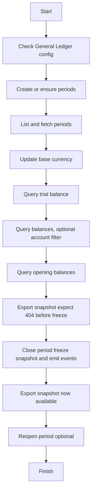
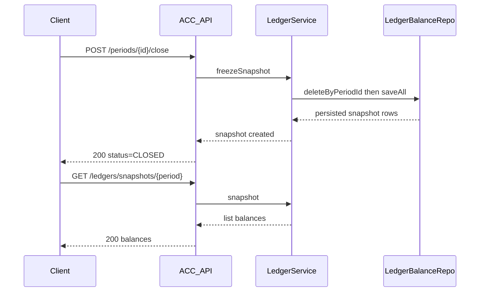

# ACC Service — Tutorial Use Cases (with copy-paste curl)

This walkthrough shows end-to-end, realistic use cases of the ACC service. It covers all REST endpoints at least once and demonstrates the primary entities involved. You can copy the curl commands as-is and run them against a locally started service on port 6161.

Assumptions:
- Service is running locally: http://localhost:6161
- Security profile is relaxed (e.g., `nosec`) so that headers are optional. We still include tenant headers for clarity.
- Use a single tenantId for the tutorial: `00000000-0000-0000-0000-000000000001`.

Tip: The service also exposes OpenAPI/Swagger:
- Swagger UI: http://localhost:6161/swagger-ui/index.html
- OpenAPI JSON: http://localhost:6161/v3/api-docs
- OpenAPI YAML: http://localhost:6161/v3/api-docs.yaml

## Quick environment setup (optional)
For convenience, define these variables in your shell so you can paste shorter commands later:

- PowerShell:
  - `$env:BASE_URL = "http://localhost:6161/api/fi/acc/v1"`
  - `$env:TENANT = "00000000-0000-0000-0000-000000000001"`
- Bash:
  - `export BASE_URL="http://localhost:6161/api/fi/acc/v1"`
  - `export TENANT="00000000-0000-0000-0000-000000000001"`

All curl commands below show both a plain version and a variant using `BASE_URL` and `TENANT` env vars.

---

## Mermaid overview



Entities you will see:
- GeneralLedger — service/config view
- Period — accounting period lifecycle (OPEN -> CLOSED -> OPEN)
- LedgerBalance — derived balances per period
- ChartMetadata — metadata of the active chart of accounts

---

## 1) Check General Ledger configuration (GET /general-ledger)

Returns the current General Ledger configuration including baseCurrency and the current open period id if available.

Plain curl:

```bash
curl -s -H "X-Tenant-Id: 00000000-0000-0000-0000-000000000001" \
  http://localhost:6161/api/fi/acc/v1/general-ledger | jq .
```

With env vars:

```bash
curl -s -H "X-Tenant-Id: $TENANT" "$BASE_URL/general-ledger" | jq .
```

---

## 2) Create or ensure periods (POST /periods)

Create two example periods (YYYY, MM). Creation is idempotent by (year, month). Expects JSON body matching `Period`.

```bash
# Create 2025-12
curl -s -X POST -H "Content-Type: application/json" -H "X-Tenant-Id: $TENANT" \
  -d '{"uuid":null, "month":12, "year":2025, "status":"OPEN"}' \
  "$BASE_URL/periods" | jq .

# Create 2025-11
curl -s -X POST -H "Content-Type: application/json" -H "X-Tenant-Id: $TENANT" \
  -d '{"uuid":null, "month":11, "year":2025, "status":"OPEN"}' \
  "$BASE_URL/periods" | jq .
```

---

## 3) List and fetch periods (GET /periods, /periods/{id}, /periods/current)

- List all
```bash
curl -s -H "X-Tenant-Id: $TENANT" "$BASE_URL/periods" | jq .
```

- Filter by year
```bash
curl -s -H "X-Tenant-Id: $TENANT" "$BASE_URL/periods?year=2025" | jq .
```

- Filter by status
```bash
curl -s -H "X-Tenant-Id: $TENANT" "$BASE_URL/periods?status=OPEN" | jq .
```

- Get by id (replace with a UUID you saw in the list)
```bash
PERIOD_ID="PUT-A-UUID-HERE" \
&& curl -s -H "X-Tenant-Id: $TENANT" "$BASE_URL/periods/$PERIOD_ID" | jq .
```

- Get current open period
```bash
curl -s -H "X-Tenant-Id: $TENANT" "$BASE_URL/periods/current" | jq .
```

---

## 4) Update General Ledger base currency (PATCH /general-ledger)

Change the base currency to USD (allowed only if there are no postings yet). If the service has already processed postings, this returns 409.

- Successful update example:
```bash
curl -s -X PATCH -H "Content-Type: application/json" -H "X-Tenant-Id: $TENANT" \
  -d '{"baseCurrency":"USD"}' \
  "$BASE_URL/general-ledger" | jq .
```

- Validation error example (null baseCurrency → 400 Base currency required):
```bash
curl -s -X PATCH -H "Content-Type: application/json" -H "X-Tenant-Id: $TENANT" \
  -d '{"baseCurrency":null}' \
  -w "\nHTTP %{http_code}\n" \
  "$BASE_URL/general-ledger" | jq .
```

---

## 5) Chart metadata (GET /charts/current)

Fetch metadata about the active Chart of Accounts (e.g., account count). This endpoint exercises the `ChartMetadata` entity.

```bash
curl -s -H "X-Tenant-Id: $TENANT" "$BASE_URL/charts/current" | jq .
```

---

## 6) Query ledgers (GET /ledgers/*)

Assume we are exploring period `2025-12`.

- Trial balance (derived on-the-fly if period is OPEN):
```bash
curl -s -H "X-Tenant-Id: $TENANT" \
  "$BASE_URL/ledgers/trial-balance?period=2025-12" | jq .
```

- Balances (all accounts):
```bash
curl -s -H "X-Tenant-Id: $TENANT" \
  "$BASE_URL/ledgers/balances?period=2025-12" | jq .
```

- Balances (filtered by accountId): replace ACC_ID by an account UUID you know exists
```bash
ACC_ID="PUT-ACCOUNT-UUID-HERE" \
&& curl -s -H "X-Tenant-Id: $TENANT" \
  "$BASE_URL/ledgers/balances?period=2025-12&accountId=$ACC_ID" | jq .
```

- Opening balances for a period:
```bash
curl -s -H "X-Tenant-Id: $TENANT" \
  "$BASE_URL/ledgers/opening-balances?period=2025-12" | jq .
```

- Export snapshot (only available after period is CLOSED and snapshot frozen):
  - Expected 404 before closing:
```bash
curl -s -H "X-Tenant-Id: $TENANT" -w "\nHTTP %{http_code}\n" \
  "$BASE_URL/ledgers/snapshots/2025-12" | jq .
```

---

## 7) Close period and export snapshot

Closing a period triggers freezing the ledger snapshot. Afterwards, the snapshot export should return 200 with rows.

- Close a period (use an existing period id — here we assume you stored one earlier):
```bash
PERIOD_ID="PUT-2025-12-UUID-HERE" \
&& curl -s -X POST -H "X-Tenant-Id: $TENANT" \
  "$BASE_URL/periods/$PERIOD_ID/close" | jq .
```

- Export snapshot now (should be available):
```bash
curl -s -H "X-Tenant-Id: $TENANT" \
  "$BASE_URL/ledgers/snapshots/2025-12" | jq .
```

- Try to open a CLOSED period (should be 409 CONFLICT):
```bash
curl -s -X POST -H "X-Tenant-Id: $TENANT" -w "\nHTTP %{http_code}\n" \
  "$BASE_URL/periods/$PERIOD_ID/open" | jq .
```

---

## 8) Reopen period (optional)

If needed, you can reopen a CLOSED period back to OPEN.

```bash
curl -s -X POST -H "X-Tenant-Id: $TENANT" \
  "$BASE_URL/periods/$PERIOD_ID/reopen" | jq .
```

---

## Mermaid sequence for period close → snapshot export



---

## Troubleshooting tips
- Use `-v` with curl to inspect headers and status codes in detail.
- If you run with the `keycloak` profile, ensure you have proper authentication or disable filters for local testing.
- If Swagger/OpenAPI returns 500 under `nosec`, update to latest version where header parsing is non-fatal (optional headers).
- Use `X-Trace-Id` header to correlate requests in logs:
```bash
curl -s -H "X-Trace-Id: demo-trace-123" -H "X-Tenant-Id: $TENANT" "$BASE_URL/general-ledger" | jq .
```

---

## Coverage matrix (what we exercised)
- GeneralLedgerController
  - GET /general-ledger — ✔
  - PATCH /general-ledger — ✔ (valid + 400 example)
  - GET /charts/current — ✔
- PeriodController
  - GET /periods — ✔ (list + filters)
  - GET /periods/{id} — ✔
  - POST /periods — ✔
  - POST /periods/{id}/open — ✔ (409 after close)
  - POST /periods/{id}/close — ✔
  - POST /periods/{id}/reopen — ✔
  - GET /periods/current — ✔
- LedgerController
  - GET /ledgers/trial-balance — ✔
  - GET /ledgers/balances — ✔ (with and without accountId)
  - GET /ledgers/opening-balances — ✔
  - GET /ledgers/snapshots/{period} — ✔ (404 before close, 200 after close)

This completes a full, hands-on tutorial that you can follow step-by-step with copy/paste curl commands.